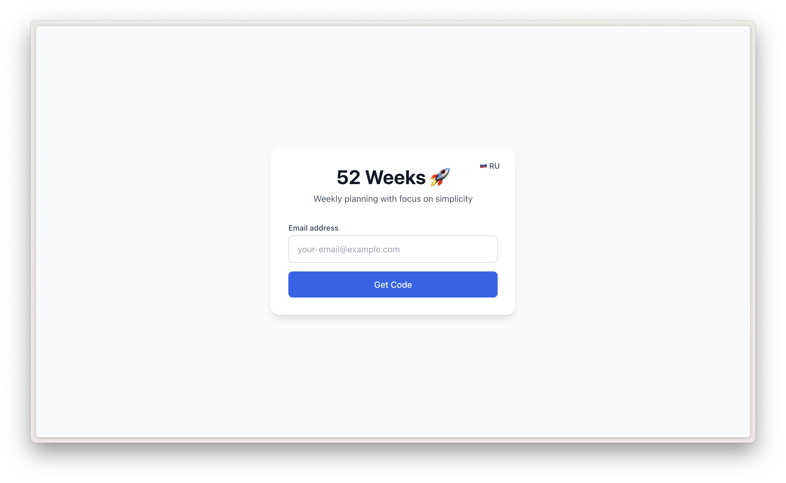
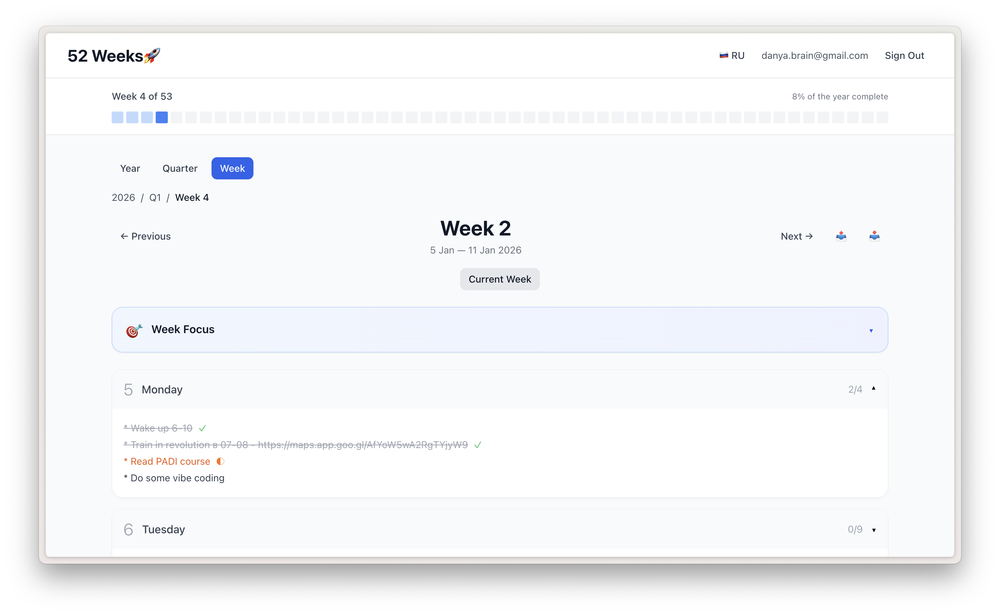

# 52 Weeks

Минималистичное приложение для недельного планирования. Ключевая идея — свободный текстовый ввод как в Apple Notes, но со структурой 52 недель в году.

## Особенности

- 📅 Недельное планирование (52 недели в году)
- 🎯 Фокус недели + ежедневные задачи
- 🌐 **Мультиязычность (EN/RU)** - автоматическое определение языка
- 📱 **Полностью адаптивно** - отлично работает на iPhone и iPad
- 🔐 **OTP аутентификация**: Вход по 6-значному коду из email (отлично для мобильных)
- 📤 **Экспорт/импорт** - синхронизация с Apple Notes через текстовые файлы
- 🔐 Email whitelist для ограничения доступа
- 💾 Автосохранение + offline-first
- 🔒 Cookie-based authentication с fallback для iOS
- 🚀 Docker + Nginx ready

## Screenshots

### Login Page



### Week Planning



## Технологии

- **Frontend**: React 18 + TypeScript + Vite
- **Стили**: Tailwind CSS
- **State**: Zustand
- **Backend**: Supabase (PostgreSQL + Auth + Realtime)
- **i18n**: Custom (EN/RU)

## Ключевые функции

### Аутентификация

Простой и безопасный вход по email:

1. Введите email
2. Получите 6-значный код на почту
3. Введите код в приложение
4. Готово!

Отлично работает на мобильных устройствах - не нужно переключаться между приложениями.

### Экспорт/Импорт

Синхронизируйте данные с Apple Notes или другими приложениями:

- Экспортируйте неделю в текстовый файл
- Редактируйте в Apple Notes на iPhone/Mac
- Импортируйте обратно в приложение
- Формат поддерживает русские и английские названия дней

## Быстрый старт

### 1. Установка зависимостей

```bash
npm install
```

### 2. Настройка Supabase

Краткая версия:

1. Выполните SQL миграцию из `supabase/migrations/20240119_initial_schema.sql`
2. Настройте Email Authentication в Supabase Dashboard
3. Отключите "Confirm Email" для разработки
4. Добавьте `http://localhost:5173` в Redirect URLs

### 3. Переменные окружения

Создайте `.env` файл:

```bash
cp .env.example .env
```

Укажите ваши Supabase credentials в `.env`:

```env
VITE_SUPABASE_URL=https://your-project.supabase.co
VITE_SUPABASE_ANON_KEY=your-anon-key-here

# Опционально: ограничить доступ только определенным email (защита от злоупотреблений)
VITE_ALLOWED_EMAILS=your-email@example.com,friend@example.com
```

**Email Whitelist** (опционально): Для ограничения доступа только вам и вашим друзьям, укажите разрешенные email адреса. Оставьте пустым для открытого доступа.

### 4. Запуск проекта

```bash
npm run dev
```

Откройте [http://localhost:5173](http://localhost:5173)

## Лицензия

MIT
